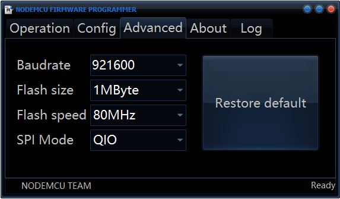
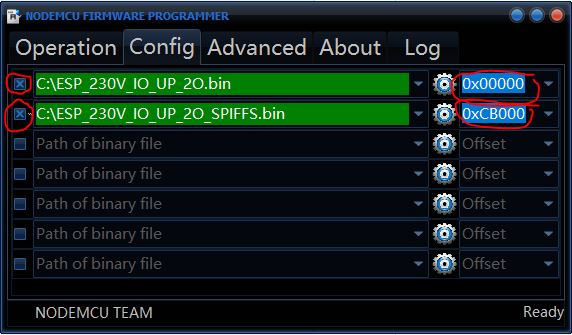
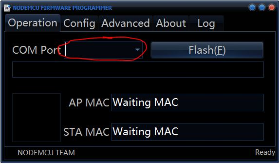
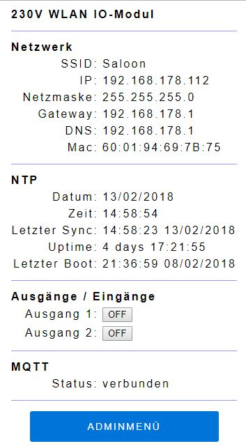
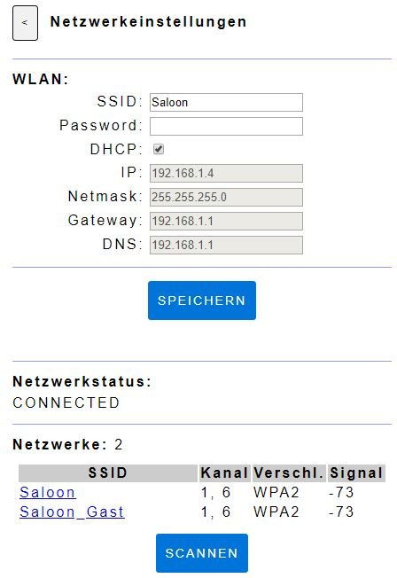

# 230V-WLAN-IO-Modul
This ESP8266 Firmware is developed to run on the *ESP8266 230V I/O Modul* developed by **luani**. 
You can find luanis project page here: https://luani.de/projekte/esp8266-hvio

The Webserver of this Firmware is based on *FSBrowserNG* by **Germán Martín**: https://github.com/gmag11/FSBrowserNG

For now the language of the Webserver is German.
## Table of contents
- [230V-WLAN-IO-Modul ](#230v-wlan-io-modul)
  - [Functions](#functions)
  - [Installation using precompiled binaries](#installation-using-precompiled-binaries)
  - [First Configuration](#first-configuration)
  - [MQTT Configuration](#mqtt-configuration)
  - [Input and Output Configuration](#input-and-output-configuration)
  - [Setup your own firmware update server](#setup-your-own-firmware-update-server)
  - [Using the sourcecode](#using-the-sourcecode)
    - [Dependencies](#dependencies)

## Functions
- Configurable via built-in asynchronous Webserver
  - built-in SPIFFS file editor, so you can edit all html, css, js,... files online!
- NTP Time synchronisation
- Full asynchronous MQTT support
  - publish output state
  - publish input changes
  - subscribe to topic to control outputs
  - select *qos* and *retain* for each publish or subscribe separately
- Automatic Firmware Update
  - MQTT update trigger topic configurable
- Configurable input-output-dependencies
- Config is stored on SPIFFS
 
## Installation using precompiled binaries
1. Download [nodemcu-flasher](https://github.com/nodemcu/nodemcu-flasher "NODEMCU FIRMWARE PROGRAMMER") *.exe file
2. Download latest [release](https://github.com/BauerPh/230V-WLAN-IO-Modul/releases)
   - use `ESP_230V_IO_UP_2O.bin` and `ESP_230V_IO_UP_2O_SPIFFS.bin` for the *ESP8266 230V I/O Modul* by luani
3. Open *nodemcu-flasher*
4. Connect your ESP and bring it in flash mode
5. Configure Nodemcu Firmware Programmer: 

6. Select binaries downloaded in Step 2 and don't forget to tick the two boxes!: 

7. Select COM-Port and press *Flash*: 

8. Thats it! Restart ESP and try to connect to it's WiFi Hotspot!

## First configuration
After flashing the firmware the module should appear as a WiFi Acces Point (AP-Mode).
- Name of Acces Point: `ESP...`
- Connect to it
- Open `http://192.168.4.1` in your Webbrowser. It should look like this: 

- Go to *ADMINMENÜ* -> *NETZWERKEINSTELLUNGEN*: 

- Set your WiFi & Network Config here and press *SPEICHERN*: 

- Press *Neustart* to restart the ESP
- Now the ESP tries to connect to your WiFi network, it will no longer be available as a AP!
- If the ESP fails connecting to the WiFi network, it will open a AP again after about 30 seconds.
- After another 30 seconds the ESP tries to connect to the WiFi network again (if no client is connected to the AP).
- After a WiFi connection is established the ESP will never go to AP mode again even when it has lost connection. You need to restart it manually (Power off, Power on) to get it in AP Mode again.

## MQTT Configuration
TODO

## Input and Output Configuration
TODO

## Setup your own firmware update server
TODO

## Using the sourcecode
I recommend using the Visual Micro Extension for Microsoft Visual Studio

### Dependencies
- `FSWebServerLib` Async Webserver Library by **BauerPh** https://github.com/BauerPh/FSWebServerLib
- `JSONtoSPIFFS` JSON to SPIFFS Library by **BauerPh** https://github.com/BauerPh/JSONtoSPIFFS
- `Time` Arduino Time Library by **Paul Stoffregen** https://github.com/PaulStoffregen/Time
- `NtpClient` NTP Client Library by **Germán Martín** https://github.com/gmag11/NtpClient
- `ESPAsyncTCP` Async TCP Library by **Me No Dev** https://github.com/me-no-dev/ESPAsyncTCP
- `ESPAsyncWebServer` Async HTTP and WebSocket Server by **Me No Dev** https://github.com/me-no-dev/ESPAsyncWebServer
- `ArduinoJson` JSON Library by **Benoît Blanchon** https://github.com/bblanchon/ArduinoJson
- `async-mqtt-client` asynchronous MQTT client by **Marvin Roger** https://github.com/marvinroger/async-mqtt-client